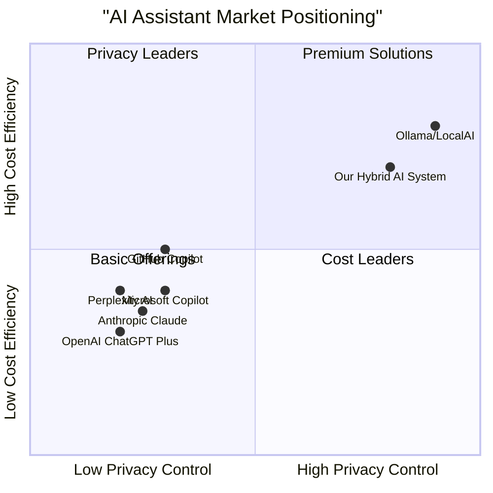

# Product Requirements Document (PRD)
# Hybrid Local-First AI Architecture System

**Version:** 1.0  
**Date:** September 1, 2025  
**Language:** English  
**Programming Languages:** TypeScript, C#, Python  
**Project Name:** hybrid_ai_system  

## Original Requirements Restatement

Implement a production-ready hybrid local-first AI architecture system with an Azure-hosted backend and intelligent, hardware-aware clients. The system should provide seamless routing between local and cloud AI processing, maintain privacy-first principles, implement robust budget governance, and deliver a superior user experience across desktop and mobile platforms.

---

## 1. Product Definition

### 1.1 Product Goals

1. **Intelligent Resource Optimization**: Automatically route AI workloads between local hardware and cloud resources based on capability, cost, and privacy requirements to maximize performance while minimizing expenses.

2. **Privacy-First AI Processing**: Ensure sensitive data remains local by default, with explicit user consent and data redaction/summarization before any cloud escalation, maintaining user trust and regulatory compliance.

3. **Seamless Multi-Platform Experience**: Deliver consistent AI assistance across Windows, Linux, macOS, and mobile devices with voice-first interaction, offline resilience, and real-time synchronization.

### 1.2 User Stories

**As a Privacy-Conscious Professional**, I want my sensitive documents and conversations to be processed locally by default, so that I can leverage AI assistance without compromising confidential information.

**As a Cost-Conscious Developer**, I want transparent budget tracking and automatic routing to cost-effective AI models, so that I can maximize my AI usage within monthly budget constraints.

**As a Mobile Knowledge Worker**, I want voice-first AI interaction that works seamlessly across my laptop and mobile devices, so that I can access my AI assistant anywhere with consistent context and capabilities.

**As an Enterprise Administrator**, I want centralized policy management and usage analytics across all user devices, so that I can ensure compliance, manage costs, and optimize AI resource allocation.

**As a Power User with High-End Hardware**, I want the system to automatically detect my NPU/GPU capabilities and run advanced local models, so that I can get faster responses and better privacy without unnecessary cloud costs.

### 1.3 Competitive Analysis

| Product | Strengths | Weaknesses | Market Position |
|---------|-----------|------------|-----------------|
| **OpenAI ChatGPT Plus** | Excellent model quality, wide adoption, plugin ecosystem | Cloud-only, privacy concerns, limited customization | Market leader (0.8, 0.9) |
| **Microsoft Copilot** | Enterprise integration, Azure ecosystem, multi-modal | Heavy cloud dependency, high costs, limited local processing | Enterprise focused (0.7, 0.6) |
| **Anthropic Claude** | Strong safety features, excellent reasoning, API flexibility | Cloud-only, limited availability, no local options | Quality focused (0.6, 0.8) |
| **Ollama/LocalAI** | Full local control, privacy, cost-effective | Limited model quality, complex setup, no cloud fallback | Developer niche (0.3, 0.5) |
| **Perplexity AI** | Excellent search integration, real-time data, citations | Cloud-only, limited customization, subscription model | Search specialist (0.5, 0.7) |
| **GitHub Copilot** | Code-focused, IDE integration, developer adoption | Narrow use case, cloud dependency, privacy concerns | Developer tools (0.6, 0.7) |
| **Our Hybrid AI System** | Local-first privacy, intelligent routing, budget control, multi-platform | New market entry, complex architecture | Target position (0.5, 0.6) |

### 1.4 Competitive Quadrant Chart



---

## 2. Technical Specifications

### 2.1 Requirements Analysis

The hybrid local-first AI architecture requires a sophisticated multi-tier system that intelligently balances performance, privacy, and cost across diverse hardware environments. The system must handle real-time routing decisions, maintain consistent user experience across platforms, and provide enterprise-grade security and observability.

**Core Technical Challenges:**
- Dynamic hardware capability detection and model selection
- Real-time routing policy engine with sub-second decision making
- Secure, scalable memory store with versioning and access controls
- Cross-platform client deployment and automatic updates
- Budget governance with predictive cost modeling
- Privacy-preserving data flow with selective escalation

### 2.2 Azure Backend Architecture

#### 2.2.1 Core Services

**Azure Functions (Consumption Plan)**
- `routing-engine`: Policy-based routing decisions (TypeScript)
- `memory-store-api`: CRUD operations for user memory (C#)
- `budget-governance`: Cost tracking and enforcement (C#)
- `search-aggregator`: Multi-source search and ranking (Python)
- `telemetry-collector`: Usage analytics and monitoring (C#)

**Azure App Service (Premium P1V3)**
- `api-gateway`: Main API orchestration and authentication
- `admin-dashboard`: Enterprise management interface
- `provider-adapters`: External AI service integrations

**Azure Cosmos DB**
- `user-memory`: Partitioned by user_id, globally distributed
- `telemetry-data`: Time-series data for analytics
- `configuration`: Feature flags and routing policies
- `budget-tracking`: Real-time cost and usage data

**Azure SignalR Service**
- Real-time client notifications
- Live budget warnings and route updates
- Multi-device synchronization

#### 2.2.2 Database Schema

**User Memory Collection**
```json
{
  "id": "mem_user123_snippet456",
  "user_id": "user123",
  "content": "encrypted_content_blob",
  "metadata": {
    "source": "chat|document|web",
    "timestamp": "2025-09-01T10:30:00Z",
    "version": 1,
    "access_level": "private|shared|public",
    "tags": ["work", "project-alpha"],
    "content_hash": "sha256_hash"
  },
  "vector_embedding": [0.1, 0.2, ...],
  "ttl": 7776000
}
```

**Telemetry Collection**
```json
{
  "id": "tel_user123_20250901_001",
  "user_id": "user123",
  "device_id": "device456",
  "timestamp": "2025-09-01T10:30:00Z",
  "route_taken": "local|cloud-small|cloud-large",
  "task_type": "assistant|coding|search",
  "tokens_used": 150,
  "cost_usd": 0.003,
  "latency_ms": 450,
  "privacy_level": "local|redacted|full"
}
```

#### 2.2.3 API Specifications

**Routing Engine API**
```typescript
POST /api/v1/route
{
  "user_id": string,
  "device_capability": "heavy|medium|light",
  "task_type": "assistant|coding|search",
  "input_tokens": number,
  "privacy_level": "local_only|allow_cloud|allow_external",
  "budget_remaining": number
}

Response:
{
  "route": "local|cloud-small|cloud-large",
  "model_config": {
    "provider": "local|azure|openai|anthropic",
    "model": "gpt-4o-mini|claude-3-haiku",
    "max_tokens": 2000
  },
  "estimated_cost": 0.05,
  "reasoning": "Budget allows cloud-large for complex coding task"
}
```

### 2.3 Cross-Platform Client Requirements

#### 2.3.1 Desktop Application (Tauri + React)

**Hardware Detection Module**
```typescript
interface HardwareCapability {
  cpu: {
    cores: number;
    architecture: "x64" | "arm64";
    features: string[];
  };
  gpu: {
    vendor: "nvidia" | "amd" | "intel" | "apple";
    memory_gb: number;
    compute_capability?: string;
  };
  npu: {
    available: boolean;
    tops?: number;
    vendor?: string;
  };
  memory_gb: number;
  profile: "heavy" | "medium" | "light";
}
```

**Local Model Integration**
- ONNX Runtime for cross-platform inference
- Model quantization support (INT8, FP16)
- Dynamic model loading based on hardware profile
- Automatic model updates and caching

**Voice Interface Requirements**
- Wake word detection (offline)
- Streaming speech-to-text
- Voice activity detection (VAD)
- Text-to-speech with natural voices
- Noise cancellation and echo suppression

#### 2.3.2 Mobile Application (React Native)

**Core Features**
- Simplified hardware detection (CPU/GPU only)
- Voice-first interaction with touch fallback
- Offline mode with local caching
- Push notifications for budget warnings
- Biometric authentication integration

### 2.4 Requirements Pool

#### P0 Requirements (Must Have)

1. **REQ-001**: System MUST detect hardware capabilities and select appropriate local model profile
2. **REQ-002**: System MUST implement three-tier routing (local → cloud-small → cloud-large)
3. **REQ-003**: System MUST enforce budget caps with real-time tracking
4. **REQ-004**: System MUST provide Azure AD B2C authentication with device registration
5. **REQ-005**: System MUST encrypt all data at rest and in transit
6. **REQ-006**: System MUST support offline operation for basic tasks
7. **REQ-007**: System MUST provide real-time cost visibility to users
8. **REQ-008**: System MUST implement privacy-first data handling with local processing preference

#### P1 Requirements (Should Have)

1. **REQ-101**: System SHOULD support voice-first interaction with wake word detection
2. **REQ-102**: System SHOULD provide multi-device synchronization via SignalR
3. **REQ-103**: System SHOULD implement search aggregation from multiple sources
4. **REQ-104**: System SHOULD support plugin architecture for external providers
5. **REQ-105**: System SHOULD provide enterprise admin dashboard
6. **REQ-106**: System SHOULD implement automatic model updates
7. **REQ-107**: System SHOULD support custom routing policies
8. **REQ-108**: System SHOULD provide detailed usage analytics

#### P2 Requirements (Nice to Have)

1. **REQ-201**: System MAY support custom local model fine-tuning
2. **REQ-202**: System MAY provide API for third-party integrations
3. **REQ-203**: System MAY implement federated learning capabilities
4. **REQ-204**: System MAY support collaborative workspaces
5. **REQ-205**: System MAY provide advanced visualization dashboards
6. **REQ-206**: System MAY support multiple AI provider simultaneous querying

### 2.5 UI Design Draft

#### 2.5.1 Main Dashboard Layout

```
┌─────────────────────────────────────────────────────────────┐
│ [Logo] Hybrid AI Assistant    [Profile] [Settings] [Help]  │
├─────────────────────────────────────────────────────────────┤
│                                                             │
│ ┌─────────────────┐  ┌──────────────────┐  ┌─────────────┐ │
│ │ Hardware Status │  │ Current Route    │  │ Budget      │ │
│ │ ● NPU: Active   │  │ 🔄 Cloud-Small   │  │ $23.45/$50  │ │
│ │ ● GPU: 8GB      │  │ ⚡ 245ms latency │  │ 53% used    │ │
│ │ ● Profile: Heavy│  │ 💰 $0.03/query   │  │ 12 days left│ │
│ └─────────────────┘  └──────────────────┘  └─────────────┘ │
│                                                             │
│ ┌───────────────────────────────────────────────────────┐   │
│ │ 🎤 Voice Input Active          [Assistant|Coding|Search] │ │
│ │                                                         │ │
│ │ > "Help me analyze this data..."                        │ │
│ │                                                         │ │
│ │ ✓ Processing locally (privacy mode)                     │ │
│ │ ⏱️ Estimated completion: 15 seconds                      │ │
│ └───────────────────────────────────────────────────────┘   │
│                                                             │
│ ┌─────────────────┐  ┌──────────────────┐  ┌─────────────┐ │
│ │ Recent Memory   │  │ Active Tasks     │  │ Quick Actions│ │
│ │ • Project Alpha │  │ • Code Review    │  │ 🔍 Search   │ │
│ │ • Meeting Notes │  │ • Data Analysis  │  │ 💬 Chat     │ │
│ │ • Research      │  │                  │  │ ⚙️ Settings │ │
│ └─────────────────┘  └──────────────────┘  └─────────────┘ │
└─────────────────────────────────────────────────────────────┘
```

#### 2.5.2 Privacy Control Interface

```
┌─────────────────────────────────────────────────────────────┐
│ Privacy & Routing Settings                                  │
├─────────────────────────────────────────────────────────────┤
│                                                             │
│ Data Processing Preferences:                                │
│ ○ Maximum Privacy (Local Only)                              │
│ ● Balanced (Local + Cloud with redaction)                   │
│ ○ Performance First (Allow cloud processing)                │
│                                                             │
│ Content Classification:                                     │
│ ┌─────────────────────────────────────────────────────────┐ │
│ │ 🔒 Never Leave Device:                                  │ │
│ │ • Financial documents                                   │ │
│ │ • Personal conversations                                │ │
│ │ • Medical information                                   │ │
│ └─────────────────────────────────────────────────────────┘ │
│                                                             │
│ ┌─────────────────────────────────────────────────────────┐ │
│ │ ☁️ Allow Cloud Processing:                               │ │
│ │ • Code reviews (anonymized)                             │ │
│ │ • Research summaries                                    │ │
│ │ • General questions                                     │ │
│ └─────────────────────────────────────────────────────────┘ │
└─────────────────────────────────────────────────────────────┘
```

### 2.6 Open Questions

1. **Local Model Distribution**: How should we handle the distribution and updates of large local AI models across different platforms and network conditions?

2. **Hardware Compatibility**: What is the minimum hardware specification for each capability tier, and how should we handle edge cases with unusual hardware configurations?

3. **Enterprise Deployment**: How can enterprise customers deploy and manage the system across thousands of devices with custom policies and compliance requirements?

4. **Data Residency**: How should we handle data residency requirements for international customers, particularly with memory store synchronization?

5. **Model Licensing**: What are the licensing implications of distributing local AI models, and how should we handle commercial vs. open-source model options?

6. **Fallback Strategies**: How should the system behave when all routing options fail, and what offline capabilities are essential for business continuity?

---

## 3. Implementation Phases

### Phase 1: Foundation (Months 1-3)
**Core Backend Services and Basic Desktop Client**

**Deliverables:**
- Azure infrastructure setup with Cosmos DB, Functions, and App Service
- Basic authentication with Azure AD B2C
- Simple desktop client with hardware detection
- Basic routing engine (local vs. cloud-small)
- Memory store with CRUD operations
- Budget tracking foundation

**Success Criteria:**
- Desktop client can authenticate and detect hardware
- Basic chat functionality with cloud routing
- Memory snippets can be stored and retrieved
- Budget tracking shows real-time usage

### Phase 2: Intelligence (Months 4-6)
**Advanced Routing Logic and Local Model Integration**

**Deliverables:**
- Local AI model integration with ONNX Runtime
- Advanced routing policies with privacy controls
- Search aggregation from multiple sources
- Provider adapters for OpenAI, Anthropic
- Enhanced budget governance with predictions

**Success Criteria:**
- Local models run efficiently on heavy-profile devices
- Intelligent routing based on task complexity and budget
- Search results aggregated and ranked effectively
- Budget predictions prevent overspend

### Phase 3: Experience (Months 7-9)
**Voice Interface and Mobile Client Support**

**Deliverables:**
- Voice-first interface with wake word detection
- React Native mobile application
- Real-time synchronization via SignalR
- Advanced privacy controls and data redaction
- Enterprise admin dashboard

**Success Criteria:**
- Voice interaction works reliably across devices
- Mobile app provides core functionality
- Multi-device sync maintains consistent state
- Enterprise customers can manage policies

### Phase 4: Scale (Months 10-12)
**Advanced Features and Production Optimizations**

**Deliverables:**
- Advanced analytics and observability
- Plugin architecture for extensibility
- Performance optimizations and caching
- Comprehensive documentation and support
- Production monitoring and alerting

**Success Criteria:**
- System handles 10,000+ concurrent users
- Plugin ecosystem enables third-party integrations
- 99.9% uptime with comprehensive monitoring
- Customer support processes established

---

## 4. Technical Stack Details

### 4.1 Backend Technology Stack

**Core Services**
- **Runtime**: .NET 8 (C#), Node.js 20 (TypeScript), Python 3.11
- **Hosting**: Azure Functions (Consumption), Azure App Service (Premium P1V3)
- **Database**: Azure Cosmos DB (NoSQL), Azure SQL Database (relational data)
- **Caching**: Azure Redis Cache
- **Storage**: Azure Blob Storage (encrypted)
- **Search**: Azure Cognitive Search
- **Real-time**: Azure SignalR Service
- **Monitoring**: Azure Application Insights, Azure Monitor

**Security & Authentication**
- **Identity**: Azure AD B2C with custom policies
- **Secrets**: Azure Key Vault with managed identities
- **Encryption**: AES-256 at rest, TLS 1.3 in transit
- **Network**: Azure Private Endpoints, VNet integration

### 4.2 Client Technology Stack

**Desktop Application**
- **Framework**: Tauri 2.0 with React 18 and TypeScript 5
- **UI Library**: Shadcn/ui with Tailwind CSS
- **State Management**: Zustand with persistence
- **AI Runtime**: ONNX Runtime, WebAssembly for web models
- **Voice**: Web Speech API with fallback to native APIs
- **Updates**: Tauri's built-in updater with delta updates

**Mobile Application**
- **Framework**: React Native 0.74 with TypeScript
- **Navigation**: React Navigation 6
- **State**: Redux Toolkit with RTK Query
- **Voice**: React Native Voice with platform-specific implementations
- **Security**: Keychain (iOS) and Keystore (Android) integration

### 4.3 DevOps and Infrastructure

**Deployment**
- **Infrastructure as Code**: Azure Resource Manager (ARM) templates
- **CI/CD**: Azure DevOps with YAML pipelines
- **Containerization**: Docker for backend services
- **Monitoring**: Azure Application Insights with custom dashboards

**Development Environment**
- **Version Control**: Git with Azure Repos
- **Package Management**: npm/yarn (frontend), NuGet (backend)
- **Testing**: Jest, Playwright, MSTest
- **Code Quality**: ESLint, Prettier, SonarQube

---

## 5. Success Metrics and KPIs

### 5.1 Technical Performance Metrics

- **Routing Decision Latency**: < 100ms for 95% of requests
- **Local Model Inference**: < 2 seconds for typical queries
- **System Availability**: 99.9% uptime (8.76 hours downtime/year)
- **Budget Accuracy**: ±2% variance from actual costs
- **Memory Store Response**: < 50ms for snippet retrieval

### 5.2 User Experience Metrics

- **Voice Recognition Accuracy**: > 95% for clear audio
- **Cross-Device Sync**: < 5 seconds for state synchronization
- **Privacy Compliance**: 100% local processing for marked sensitive data
- **Client Startup Time**: < 3 seconds cold start
- **Battery Impact**: < 5% additional drain on mobile devices

### 5.3 Business Metrics

- **Cost Optimization**: 30% reduction in AI processing costs vs. cloud-only
- **User Adoption**: 80% daily active usage within 30 days
- **Privacy Satisfaction**: > 90% user confidence in data handling
- **Enterprise Deployment**: Support for 1000+ device organizations
- **Revenue per User**: Target $15/month average with tiered pricing

---

## 6. Risk Assessment and Mitigation

### 6.1 Technical Risks

**Risk**: Local model performance varies significantly across hardware
**Mitigation**: Comprehensive hardware profiling, fallback to cloud processing, adaptive model selection

**Risk**: Azure service dependencies create single points of failure
**Mitigation**: Multi-region deployment, circuit breakers, graceful degradation to local-only mode

**Risk**: Cross-platform client maintenance complexity
**Mitigation**: Shared TypeScript codebase, automated testing across platforms, staged rollouts

### 6.2 Business Risks

**Risk**: AI model licensing costs and restrictions
**Mitigation**: Diverse provider portfolio, open-source alternatives, usage-based licensing negotiations

**Risk**: Privacy regulations impact cloud processing capabilities
**Mitigation**: Configurable data residency, local-first architecture, compliance-ready features

**Risk**: Competitive response from established players
**Mitigation**: Focus on privacy and cost differentiation, rapid feature development, strong user experience

---

## 7. Conclusion

The Hybrid Local-First AI Architecture System represents a significant opportunity to address the growing demand for privacy-conscious, cost-effective AI assistance. By intelligently balancing local and cloud processing, the system can deliver superior user experience while maintaining strict privacy controls and budget governance.

The phased implementation approach ensures rapid time-to-market while building toward a comprehensive, enterprise-ready solution. Success depends on flawless execution of the core routing intelligence, seamless cross-platform experience, and unwavering commitment to privacy-first principles.

**Next Steps:**
1. Finalize technical architecture review with engineering team
2. Establish Azure infrastructure and development environments  
3. Begin Phase 1 implementation with core backend services
4. Initiate user research for interface design validation
5. Develop go-to-market strategy for target customer segments